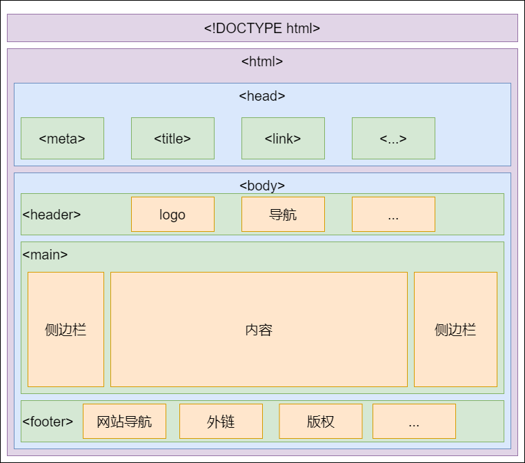
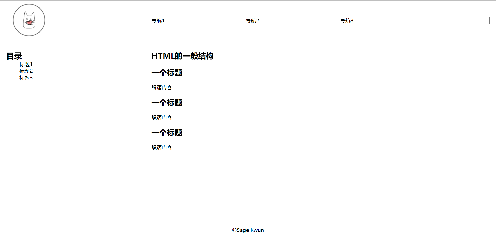

# 课 1 HTML 文档结构

## 什么是 HTML？

HTML 是一个缩写，全称是 HyperText Markup Language，超文本标记语言。

*超文本*是*超级文本*的意思，一开始是因为网页通过超链接的方式将各个空间的文字连接起来（早期的互联网还没有图片、音视频等内容）。我们也可以理解为，它将普通的文字进行了“升级”，让其拥有了表达更丰富信息的能力。例如，`<a href="https://www.baidu.com">超链接</a>`就表示*超链接*这三个字是一个指向百度网站的超链接

*标记*则表示了它描述内容的方式：通过一对标签对要表达的内容进行标记，例如`<p>段落</p>`表示*段落*是一个段落，*段落*二字被`<p></p>`所包裹.

*语言*表示了 HTML 是一个具有特定格式，或者说是“语法”的。除了前文所说的*标签标记*以外，HTML，尤其是 HTML5 中还有很多规定/规范：

- 标签和属性不区分大小写，推荐**小写**
- 空标签可以不闭合，比如 input、meta
- 属性值推荐用**双引号**包裹
- 某些属性可以省略，比如 require、readonly

## HTML 的一般结构

html 文件开头通常有一行`<!DOCTYPE html>`，表示要按照 W3C 的 HTML5 标准来解析渲染页面。之后的内容由一对`<html>`标签包裹，里面又分成`<head>`和`<body>`两部分。

`<head>`中的内容一般是与网页本身相关的内容，比如网页的元数据信息`<meta>`，网页的标题`title`，网页所需引入的其它文件`<link>`。我们所见到和使用的网页一般都引入了 CSS 和 JS 文件来进行美化和交互。

浏览器将 html 文件及相关文件渲染成我们所见的到网页，其中我们能看到的部分基本就是`<body>`中的部分。

如下文的代码，一个普通的网页一般有头部`<header>`，主题内容`<main>`，和底部`<footer>`。`<header>`中会放网站的 logo，网站的导航部分，搜索栏等等。`<footer>`中会放网站内部和其它网站的一些链接，以及版权信息等。

`<main>`中左右两边可能会有侧边栏，放网页内的导航等一些与内容有关的内容（也是各大网站广告的主要位置~）。像博客类的网站可能还会有作者的一些信息。

<div style="text-align:center">
    
    <span style="color:#d9d9d7;font-size: 14px;">HTML文档结构</span>
</div>

## 常见的 html 文档结构

```html
<!DOCTYPE html>
<html lang="en">
  <head>
    <meta charset="UTF-8" />
    <meta http-equiv="X-UA-Compatible" content="IE=edge" />
    <meta name="viewport" content="width=device-width, initial-scale=1.0" />
    <title>page</title>
    <link rel="stylesheet" type="text/css" href="./index.css" />
  </head>
  <body>
    <header>
      <div class="logo-wrapper">
        
      </div>
      <nav class="pages-nav">
        <div><a>导航1</a></div>
        <div><a>导航2</a></div>
        <div><a>导航3</a></div>
      </nav>
      <div class="center">
        <input id="search" />
      </div>
    </header>
    <main>
      <aside>
        <h2>目录</h2>
        <nav>
          <ul>
            <li>标题1</li>
            <li>标题2</li>
            <li>标题3</li>
          </ul>
        </nav>
      </aside>
      <article>
        <h1>HTML的一般结构</h1>
        <h2>一个标题</h2>
        <p>段落内容</p>
      </article>
    </main>
    <footer>&copy;Sage Kwun</footer>
  </body>
</html>
```

<div style="text-align:center">
    
    <span style="color:#d9d9d7;font-size: 14px;">效果（加了CSS）</span>
</div>
