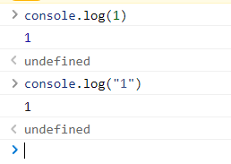
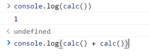

# 我对编程的理解

## 程序是什么

程序，本质上只是无数电路开和闭，抽象一下，就是一堆 01 代码。从 01 到汇编到高级代码，01 两个数字慢慢变成**可读性更好**的现代高级编程语言。

应该认识到，我们所编写的代码，本质上只是一堆**字符**，或者说**文字**。我们用记事本就可以完成所有代码的编写，所需的只是改一下文件的后缀名\(例如将.txt 改为.html\)。

那么，程序是如何从文字转为计算机可以理解的 01 代码呢？中间肯定有一个“翻译”来帮我们完成这个任务，例如 C 语言的 GNU，例如浏览器中用来处理 js 的 V8 引擎。区别在于，前者是“翻译”完再运行，而后者是“实时翻译”。

## 程序的结构

一个程序可以抽象成三个部分：输入、处理、输出。正如我们前文所说，程序本质上是一堆 01 代码，输入和输出也不意外。我们也可以说，程序的本质，是把一堆 01 代码变成另一堆 01 代码。

## 类型

100 + 1 的结果是什么？如果我们把 100 和 1 当成数字，那么结果就是 101；如果我们把他们当成”100“和”1“这两个字符的拼接，那么结果就是”1001“。这就是类型的区别。

怎么表示 1 是 1 还是”1“呢？我们可能会说：很简单，用”“包裹的是字符串，没有的则是 1。首先，一个程序里可能会有成百上千，甚至更多的变量，我们不可能全都记下来。其次，还记得我们之前提到过的程序的结构吗？我们的输入往往可能是别人程序的输出。当我们无法看到别人程序的代码的时候，我们怎么判断是 1 还是”1“呢？

类型的意义由此而生。
